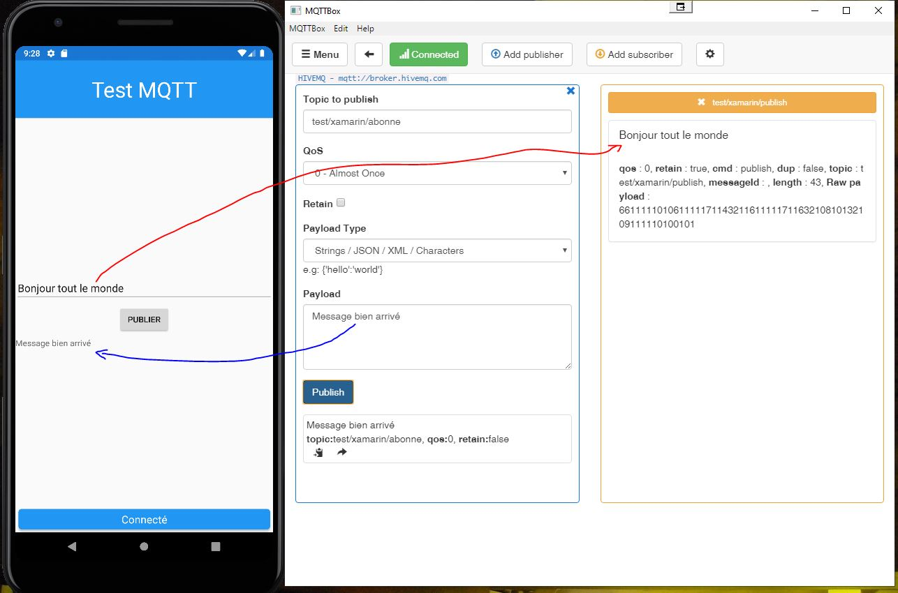
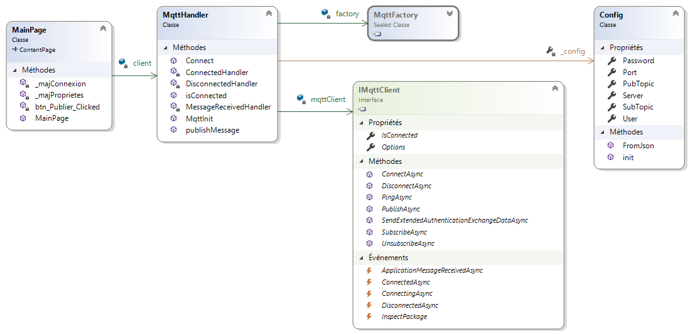

# Application de test pour MQTT avec Xamarin Forms

Cette application permet de saisir un texte et de le publier sur un topic, par exemple `test/xamarin/publish`. (flèche rouge  dans l'image ci-dessous). 

L'application est aussi abonnée à un topic (par exemple `test/xamarin/abonne`)
et affiche le message reçu dans un label (flèche bleue).
*A gauche l'application, à droite un client windows 
publiant sur **test/xamarin/abonne** et abonné à **test/xamarin/publish***
 
Le bandeau bleu en bas de l'application indique que l'application est connecté au broker.

# Configuration du projet
- Ouvrir la solution avec Visual Studio
- Renommer le fichier **`config - sample.json`** en **`config.json`**
- Éditer le fichier `config.json`
  ```javascript
  {  
    "Server": "xxxxxxxx.s1.eu.hivemq.cloud", // l'URL du cluster
    "Port": 8883, // port TLS
    "User": "user", // Onglet Access Management : Username
    "Password": "password",// onglet Access Management : Password
    "PubTopic": "test/xamarin/publish", // le topic de publication
    "SubTopic": "test/xamarin/abonne" // le topic d'abonnement
  }
  ```
- Lancer l'application.
# Diagramme de classe de l'application
 

- Dans la classe MainPage, on instancie un objet `client` de type `MqttHandler`
- 


